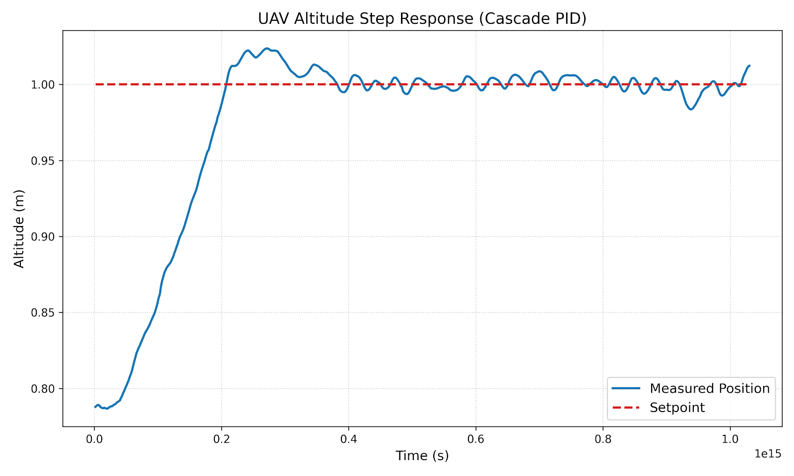

# UAV-Cascade-PID-Controller

**Multilayer cascade PID control system for UAV position & yaw tracking.** *Developed in Python using NumPy for Control Engineering coursework.*

This repository contains a robust control logic implementation designed to stabilize a quadcopter in a physics simulation (PyBullet). It features advanced error handling and data logging to validate performance against setpoint targets.

## What it does
* **Cascade Control Architecture:** Implements a customizable 1-to-4 layer cascade (Position → Velocity → Acceleration → Jerk) for precise X/Y/Z tracking.
* **Stability & Safety Features:**
    * **Anti-Windup:** Integral saturation clipping to prevent overshoot during sustained errors.
    * **Derivative Kick Mitigation:** Calculates derivative term on *measurement* rather than error where appropriate.
    * **Safety Limits:** Output saturation (clipping) to ensure control signals remain within physical actuator limits.
* **Data Acquisition:** Logs high-frequency telemetry (setpoints, errors, PID outputs) to `output.csv` for post-run analysis.

## Skills Demonstrated
* **Control Systems Design:** Implementation of cascade loops and **Ziegler–Nichols** tuning methodology for Z-axis dynamics.
* **High-Level Programming:** Object-Oriented Python (Class-based structure) and vector math using **NumPy**.
* **Commissioning Workflow:** Iterative process of simulation testing, data logging, root-cause analysis, and parameter retuning.
* **Industrial Logic:** Handling of real-world constraints (integral saturation, actuator limits) similar to PLC/SCADA safety logic.

## How to use
1.  **Prerequisites:** Python 3.x and NumPy.
    ```bash
    pip install numpy
    ```
2.  **Integration:** Import the controller into your simulation loop.
    ```python
    import controller
    # Inside simulation loop:
    velocity_commands = controller.controller(state, target, dt)
    ```

## Outputs
The system automatically generates logs for post-run analysis.
* **[View Raw Flight Data](flight_data_log.csv)**
* **Visual Performance:**


## License
MIT License
